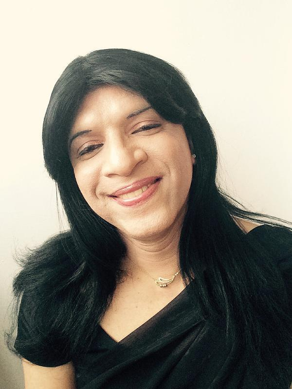
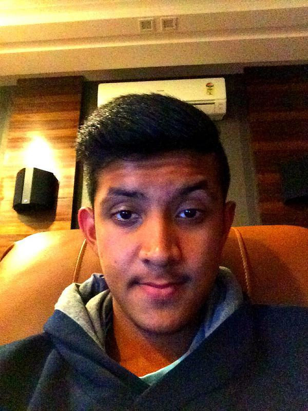
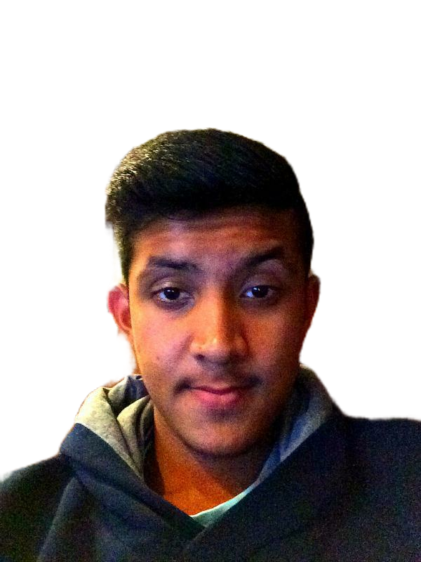

# Image-matting
This project is to separate the foreground and background of the image.

# Install

You need dependencies below.

- Python3,
- Tensorflow 1.12.0+,
- Opencv3.

# Train

If you want to use this code for training, you need to download the aisegment matting dataset.
Baidu cloud address：https://pan.baidu.com/s/1R9PJJRT-KjSxh-2-3wCGxQ, Extraction code: dzsn.
Mega address: https://mega.nz/#F!Gh8CFAyb!e2ppUh-copP76GbE8IWAEQ.
The format after decompression is as follows.
- matting_human_half/
    - clip_img #Character image(Half-length), .jpg 
    - matting  #Character annotation, .png 

In addition, we used our own labeled fine data set. Then you can use show.py to process the matting data set to generate an image with people in the foreground and white in the background.

For training, you need to change some parameters in initialization.py
- name, choose train.
- image_size, Can change the image size.
- x_train_data_path, Put the image data set path into.
- y_train_data_path, Put the annotation data set path into.

Then run main.py.

# Test
For testing, you need to change some parameters in initialization.py
- name, choose test.
- test_data_path, Put the image data set path into.

Then run main.py.

# finally

If you think this project is useful to you, please click a star.
